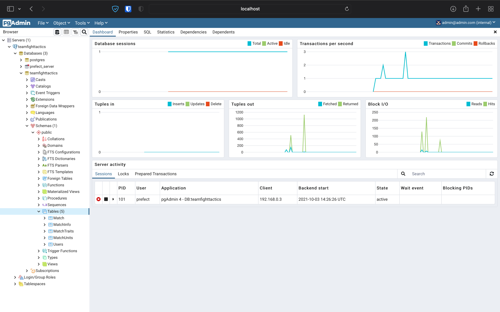
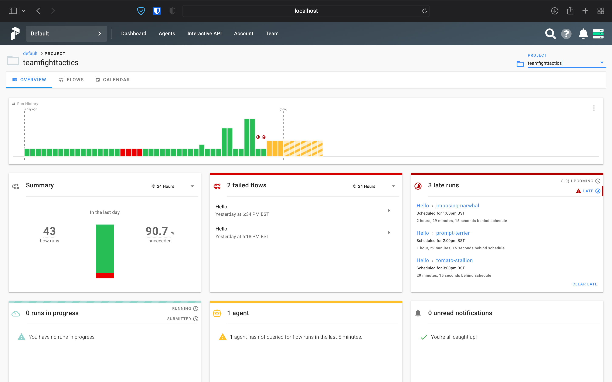

# GizmoGadgets
ETL job using Prefect to load data from Riot Games API

Using Prefect & Python to load data from the Riot Games API into a postgresql database. Allows people to get match history data to analyse the best item / team composition.

Updated for Set 6. Waiting for augments on the api.

## Requirements:
- Python
- Docker

## Installation
Setup a python virtual environment with https://docs.python.org/3/library/venv.html
```html
python -m venv venv
source venv/bin/activate
pip install -r requirements.txt
```
Easy local setup using docker-compose:
```html
docker-compose up
```
Scripts to setup Prefect locally contained in scripts.sh

## Database
Designed in https://dbdiagram.io with easy export to postgresql functionality


pgAdmin available at http://localhost:5050 to view/edit database


## Prefect Server
Use Prefect Server at http://localhost:8080 to monitor and execute flows


## To Do:
- [x] Add retrying mechanism as api is quite flaky, even with delays
- [x] Type checking with pydantic (added for simple models)
- [] Notebook with simple analysis of match data downloaded
- [] Better logging??
- [] Make it easier to run the same flow with slight adjustment (rank / tier)
- [] Create account with prefect and test the 'real' product