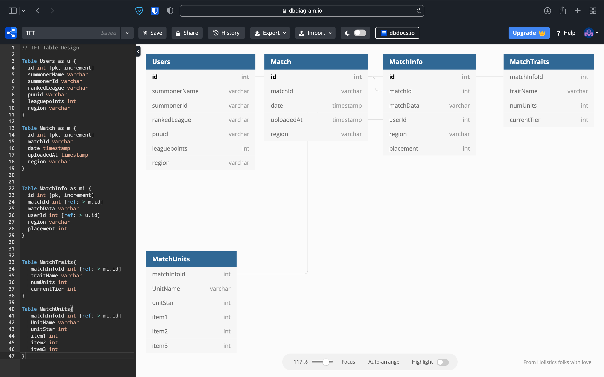

# ETL Riot Games
Using Prefect & Python to load data from the Riot Games API into a postgresql database

## Requirements:
- Python
- Prefect
- Docker
- Postgresql
- pgAdmin

## Installation
Easy local setup using docker-compose:
```html
docker-compose up
```
Scripts to setup Prefect locally contained in scripts.sh

## Database
Designed in https://dbdiagram.io with easy export to postgresql functionality


pgAdmin available at http://localhost:5050 to view/edit database


## Prefect Server
Use Prefect Server at http://localhost:8080 to monitor and execute flows
